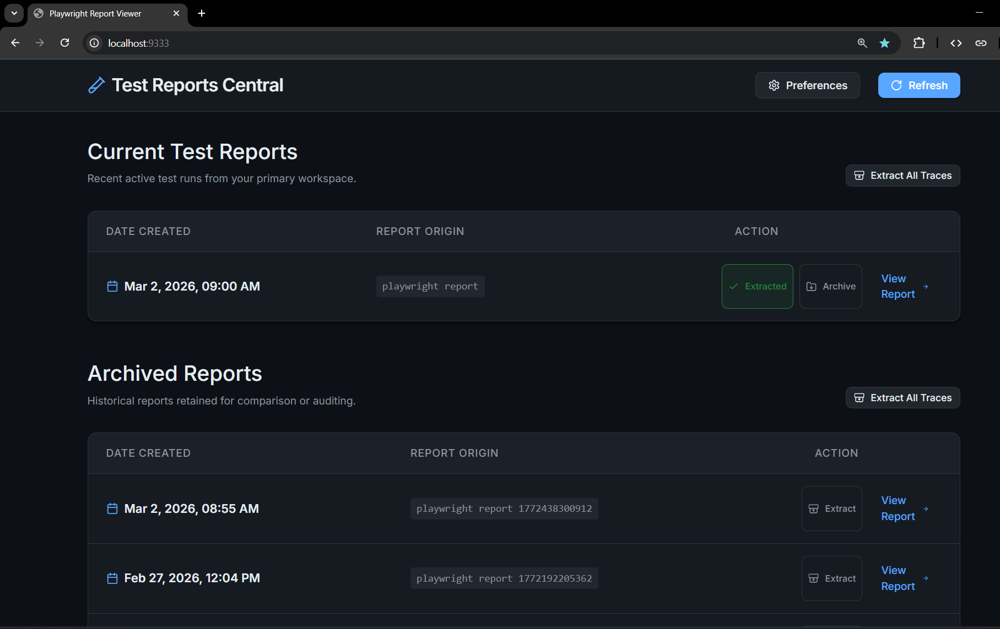

# Playwright Report Viewer



A lightweight, modern Node.js dashboard to view your Playwright test reports (with full trace functionality) without needing a local Playwright installation. It runs reliably in the background using PM2.

This project is fully compatible with **Windows, macOS, and Linux**.

## 🚀 Technologies Used

- **[TypeScript](https://www.typescriptlang.org/)**: Strongly-typed foundation for both frontend and backend reliability.
- **[Express.js](https://expressjs.com/)**: Fast, unopinionated web framework for serving APIs and isolated static assets.
- **[Vanilla JS/DOM](https://developer.mozilla.org/en-US/docs/Web/API/Document_Object_Model)**: Zero-dependency, blazing fast frontend interface.
- **[adm-zip](https://github.com/cthackers/adm-zip)**: Native, cross-platform trace extraction without external dependencies.
- **[PM2](https://pm2.keymetrics.io/)**: Advanced production process manager for running the viewer silently in the background.

## Prerequisites

- **Node.js**: Ensure Node.js is installed on your Windows machine (download from [nodejs.org](https://nodejs.org/)).
- **NPM**: Comes installed with Node.js.

## Initial Setup

1. Clone or copy this repository to your Windows machine.
2. Open a terminal (PowerShell or Command Prompt) and navigate to the project directory.
3. Install the required dependencies:
   ```cmd
   npm install
   ```
4. Start the application (this automatically compiles TypeScript and launches the server):
   ```cmd
   npm start
   ```
5. Install PM2 globally (recommended for background process management):
   ```cmd
   npm install -g pm2
   ```

## Setting Your Report Directories

You can point the dashboard to **any folders on your computer** to securely view your Playwright reports.

We support two distinct directory types to keep your active work separate from your history:

- **Current Test Reports**: The active folder where your Playwright project outputs new runs (e.g., `./playwright-report`).
- **Archived Reports**: A separate folder where you store older test runs for historical comparison.

To configure these:

1. Open the dashboard in your browser.
2. Click the **Preferences (Gear icon)** button at the top right.
3. Paste the **absolute path** to your respective folders.
   - Example (Windows): `C:\Users\Name\Projects\my-tests\`
   - Example (Mac/Linux): `/Users/name/projects/my-tests/`
4. Click **Save Changes**. The dashboard will securely save this configuration and instantly display your reports in two separate tables.

**How the folder scanning works:**
The dashboard is highly resilient. When you point it to a folder, it:

- Ignores all loose files (like PDFs, images, etc.).
- Safely skips any subdirectory that does not contain a Playwright `index.html` right at its root.
- **Deep Inspection:** It reads the `index.html` file to ensure it actually contains `<title>Playwright Test Report</title>`, guaranteeing we only display valid Playwright reports!
- This means you can point it to a messy/shared folder (like `Downloads`), and it will safely filter out everything else.

### Extracting Playwright Traces

Playwright often packages test traces (network logs, DOM snapshots) into `.zip` files inside the report's `data/` folder. The dashboard includes a built-in unzipping utility so you don't have to extract them manually!

**Why extract traces?**
Having extracted traces as raw files allows AI agents to easily read and interact with your test run data. You can feed these extracted network logs and details to an AI to:

- Automatically generate and file precise Jira defects
- Create API response assertions for your tests based on real network captures
- Analyze application performance and errors

_(Note: The actual prompts or scripts used to instruct AI agents on how to process these trace files are outside the scope of this project.)_

- **Extract a single run:** Click the **Extract** button next to any report in the table.
- **Extract all runs:** Click **Extract All Traces** at the top of a table to sequentially extract all trace zips for every visible report in that section.

_The extraction is smart and idempotent—if a trace has already been extracted, it instantly skips it to save time and disk space._

### Instantly Archiving Reports

To keep your "Current" workspace clean, you can instantly move any individual test report to your historically separated Archive folder entirely from the UI!

- **Archive a run:** Click the **Archive** button natively integrated into any row inside the _Current Test Reports_ table.
- **Safety first:** You must configure an Archive path in Preferences first via the top-right gear icon.
- **Collision-proof:** When moved, the application automatically renames the underlying folder using a precise timestamp (e.g. `playwright-report-174000...`) to guarantee no older reports are accidentally overwritten.

## Starting the Server (Background)

Use NPM scripts (which call PM2) to start the server in the background so you don't have to keep the terminal window open:

```cmd
npm start
```

Once started, open your browser and navigate to:
**👉 http://localhost:9333**

## Essential npm Commands

Here are the most common commands you'll need to manage the viewer:

- **Check Status / See if it's running:**

  ```cmd
  npx pm2 status
  ```

- **View Live Logs:**

  ```cmd
  npm run logs
  ```

- **Restart the Server:**
  _(Use this if the server ever crashes or you manually changed the `server.js` file)_

  ```cmd
  npm run restart
  ```

- **Stop the Server:**
  _(Stops the server but keeps it in the PM2 list)_

  ```cmd
  npm run stop
  ```

- **Remove the Server from PM2 entirely:**

  ```cmd
  npm run delete
  ```

- **Make PM2 auto-start the server on Windows Reboot:**
  To ensure the dashboard boots up automatically when your Windows machine restarts:
  1. **First, make sure your server is running** (e.g., you have already run `npm start`).
  2. Install the `pm2-windows-startup` package globally:
     ```cmd
     npm install pm2-windows-startup -g
     ```
  3. Install the startup script:
     ```cmd
     pm2-startup install
     ```
  4. Save the currently running PM2 processes so they launch on boot:
     ```cmd
     pm2 save
     ```

- **Make PM2 auto-start the server on macOS / Linux Reboot:**
  PM2 has built-in support for generating startup scripts in macOS and Linux.
  1. **First, make sure your server is running** (e.g., you have already run `npm start`).
  2. Generate the startup script:
     ```bash
     pm2 startup
     ```
  3. _Note: PM2 will output a specific command (often starting with `sudo`) on the screen. **You must copy and run that exact command** to configure your system's init daemon._
  4. Once configured, save the currently running PM2 processes so they launch on boot:
     ```bash
     pm2 save
     ```

- **Disable PM2 auto-start (Any OS):**
  If you no longer want the dashboard (or any PM2 process) to start automatically when your computer boots up:

  **On Windows:**

  ```cmd
  pm2-startup uninstall
  ```

  **On macOS / Linux:**

  ```bash
  pm2 unstartup
  ```

## Troubleshooting

- **No reports appearing?** Make sure you have configured your paths in the Preferences. Also verify the folders contain an `index.html` file right at the top level of that folder, and that the file contains the standard Playwright `<title>Playwright Test Report</title>` tag.
- **Port in use?** If port `9333` is already taken, you can change the port in `ecosystem.config.js`.

---

## Disclaimer

"Playwright" is a trademark of Microsoft Corporation. This project is an independent, community-driven tool and is **not** affiliated with, endorsed by, or sponsored by Microsoft or the official Playwright team. This application merely serves HTML files generated by the Playwright testing framework.

## License

This project is open-source and available under the [MIT License](LICENSE).
