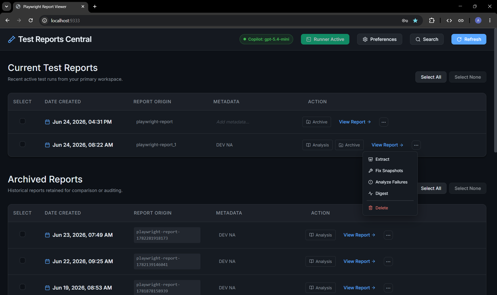
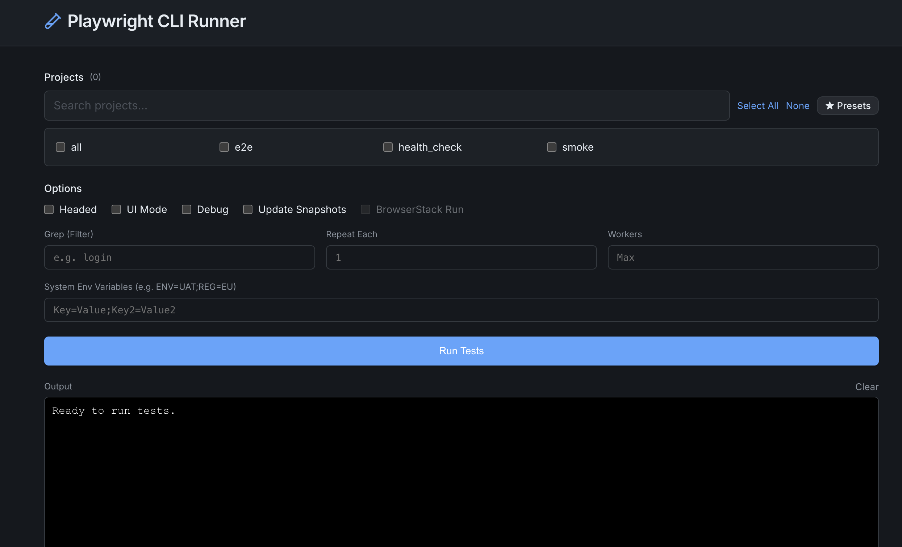

<div align="center">
  
  <h1>Playwright Test Reports Central</h1>
  <p><em>A centralized dashboard to run, view, archive, and extract Playwright tests.</em></p>

[]()
[]()
[]()
[]()

<br><br>

<br>


</div>

---

## ✨ Features

- **🌐 Serve Local HTML Reports Instantly:** Open Playwright HTML reports directly from the dashboard as locally served pages, and keep multiple reports open side-by-side in separate browser tabs without repeatedly running `npx playwright show-report`.
- **🚀 Integrated Test Runner:** Run your Playwright tests directly from the dashboard. Select projects, apply greps, configure workers, and watch the live colored terminal output stream in real-time.
- **⭐ Test Presets:** Save your favorite project selections as "Presets" to instantly recall specific test groups with one click.
- **🛡️ Preset Validation:** Automatically detects if a preset refers to projects that have been removed from your `playwright.config.ts`, preventing execution errors.
- **📊 Unified Dashboard:** View all your Playwright HTML reports in one beautifully styled, dark-mode native interface.
- **🔎 Persistent Report Search:** Open the Spotlight-style search panel from the header to filter saved reports by metadata and created date range. Applied filters stay active after the panel closes, and the Search button highlights when the dashboard is filtered.
- **📸 Aria Snapshot Fixer:** Review failed `toMatchAriaSnapshot` assertions directly from the UI. Preview Playwright's evaluated DOM diffs in full-screen, toggle deep-equal validation, and apply fixes back to your codebase with one click.
- **📦 Trace Extraction:** Extract `.zip` trace files from any individual report with a single click—perfect for feeding raw DOM/Network data to AI agents.
- **☑️ Bulk Selection Controls:** Each Current and Archived row now includes a checkbox, with table-level `Select All` and `Select None` controls for fast curation.
- **🧰 Contextual Bulk Actions:** When one or more rows are selected, the table reveals bulk actions for the selected set. Current reports support bulk archive and delete; Archived reports support bulk delete.
- **🗃️ Single-Click Archiving:** Move important runs out of your cluttered active folder and safely into a historical Archive directory.
- **🗑️ Delete Reports:** Delete obsolete or unwanted reports from either the Current or Archived folder with a single click and confirmed via a custom dialog.
- **✏️ Rename Reports:** Rename a report's origin label directly from the dashboard. The underlying folder on disk and the database record are updated atomically.
- **📝 Editable Metadata:** Add custom labels (like 'UAT NA', 'Sprint 24') to any report. Metadata is persisted in the database and follows the report if it's archived.
- **⚙️ Centralized Configuration:** Manage all your workspace paths and persistent runner options through a visual Preferences UI.
- **🗃️ Persistent Database:** All report metadata, configuration, and presets are stored in a local **SQLite** database (`app.db`), ensuring your data is safe and searchable.

---

## 🚀 Getting Started

### Prerequisites

- **Node.js**: Installed on your machine (download from [nodejs.org](https://nodejs.org/)).
- **PM2**: (Optional but recommended) for running the server in the background. Install globally via `npm install -g pm2`.
- **Playwright**: This dashboard requires Playwright to be installed in your project to run tests and resolve configurations.
- **jiti**: Used internally to resolve your Playwright configuration files on the fly.

### Installation

1. Clone or copy this repository to your machine.
2. Navigate to the project directory in your terminal.
3. Install dependencies:
   ```bash
   npm install
   ```
4. Start the application:
   ```bash
   npm start
   ```

Once started, open your browser and navigate to:  
👉 **[http://localhost:9333](http://localhost:9333)** _(or the port configured in your ecosystem file)_

---

## 🛠️ Configuration

When you first launch the app, you'll need to configure your workspaces:

1. Click the **⚙️ Preferences** button in the top right.
2. Set your directory paths (use absolute paths):
   - **Current Reports Directory:** The folder where your Playwright project outputs new runs (e.g., `playwright-report`).
   - **Archived Reports Directory:** A folder where you want to store historical test runs.
   - **Playwright Project Path:** The directory containing your `playwright.config.ts` (required for the Test Runner).
3. Click **Save Changes**. The dashboard will instantly scan the directories and display any valid reports.

> **Note:** Configuration and Presets are stored in a local **SQLite** database (`app.db`), ensuring high reliability and zero-configuration data management.

---

## 🏃‍♂️ Integrated Test Runner

Click **Run Tests** from the main dashboard to open the runner interface.

- **Dynamic Discovery:** Automatically parses your `playwright.config.ts` to detect available projects.
- **Presets System:** Save your current selection of projects as a named preset for instant reuse later.
- **Discrepancy Checks:** If you apply a preset but the underlying projects in your config have changed, the runner will notify you exactly what is missing via a clear dialog.
- **Options Persistence:** Your selections (Headed, UI Mode, custom Greps, Workers, Env Variables) are safely saved so they persist across reboots.
- **Live Output:** Features an integrated `xterm.js` terminal to stream your test execution exactly as it looks in a native console.
- **Graceful Termination:** You can stop running tests at any time without leaving zombie Node processes.

---

## 🔎 Report Search & Filtering

The dashboard includes a floating search panel in the header for quickly narrowing the visible reports without leaving the main view.

- **Scope:** Search currently matches only persisted report metadata and the report creation date.
- **Metadata Matching:** Multi-word metadata queries are case-insensitive and match when all words are present, even if other words appear between them (for example, `UAT e2e` matches `UAT EU e2e`).
- **Date Range Filtering:** Use the `From` and `To` fields to filter by a bounded or partial date range.
- **Persistent Applied Filters:** After you run a search, you can close the dialog with `X` and keep the filtered dashboard in place.
- **Highlighted Search State:** When a filter is applied, the header Search button remains visually highlighted so it is obvious that the dashboard is still filtered.
- **Reset Behavior:** Use the `Reset` button inside the dialog to clear the form values and restore the full unfiltered dashboard.
- **Keyboard Shortcut:** Press `Enter` in the search field or date inputs to submit the current filter values.
- **Refresh Safety:** While the search dialog is open, the Refresh button is temporarily disabled to avoid accidental syncs from that state. Row-level actions such as archive, delete, extract, rename, and metadata editing continue to work on the filtered results.

> **Important:** Search is intentionally read-only. Opening, submitting, closing, or resetting the search dialog does not mutate report files or rewrite report metadata. The search route queries the already persisted report index.

## 🤖 Agent API For Report Discovery

The dashboard now has a small agent-oriented API surface for local-first report discovery and preparation.

- `GET /api/agent/reports/search`: searches the persisted report index and returns report descriptors with a stable `reportRef`.
- `GET /api/agent/reports/prepare?reportRef=...`: resolves a selected report into a local analysis-ready descriptor.

This API is intended to be used by `playwright-traces-reader` helper commands or skills:

1. Search the dashboard for the intended report.
2. Prepare the selected report to get its local report root or `data/` directory.
3. Run the traditional `playwright-traces-reader` CLI commands against that local path.

The current implementation is local-first. Future remote storage support should evolve behind the same `prepare` step so the caller does not need to change behavior.

---

## 📦 Trace Extraction (AI Ready)

Playwright packages test traces (network logs, DOM snapshots) into `.zip` files.

Having extracted traces as raw JSON/network files allows AI agents to easily read and interact with your test run data (e.g., automatically generating Jira defects or API assertions).

- Click **Extract** next to any report to automatically unzip its trace files on the host machine.
- Trace extraction stays intentionally per-report, while archive and delete workflows are handled through the new multi-select controls in each table.

---

## 📸 Aria Snapshot Fixer

Reviewing failed `.yml` aria snapshots in Playwright often involves squinting at terminal outputs and manually copying strings or rerunning test with the hope it will capture exact same place. The Dashboard streamlines this entirely:

- **Intelligent Error Parsing:** Automatically parses the specific `toMatchAriaSnapshot` failures from the Base64 Playwright HTML report. It reads the Playwright evaluation engine's execution call log and codeframes to extract the exact expectations and reconstruct the DOM structures as the browser saw them.
- **Full-Screen Preview:** Click **Fix Snapshots** on any current report to open a full screen code-review dialog displaying the exact filename expected. Instead of squinting at a textarea, it presents an elegant, syntax-highlighted diff view distinguishing removed (expected) and added (new) lines.
- **Deep Equal Toggle:** A convenience checkbox allows you to seamlessly prepend `- /children: deep-equal` to newly proposed snapshots, directly updating the diff view without refreshing.
- **One-Click Apply:** Clicking **Apply Fix** will accurately resolve the snapshot path in your workspace (even accurately matching content if multiple `.yml` assertions exist in a single test), generate any missing directories, and instantly write the updated `.yml` file so you can re-run your tests immediately.

---

## 🗃️ Archiving Reports

Keep your active workspace clean by archiving old runs.

- Click **Archive** on any report in the "Current Test Reports" table for a one-off archive.
- Or select multiple rows with the new checkboxes, click **Select All** when you want the whole table, then use **Actions → Archive selected**.
- The report folder is safely moved to your configured Archive path and appended with a unique timestamp (`playwright-report-174000...`) to absolutely guarantee no collisions.

---

## 🗑️ Deleting Reports

If a report is no longer needed (whether it's in Current or Archived), you can completely remove it to free up disk space.

- Click **Delete** on any report in the tables for a one-off removal, or select multiple rows and use **Actions → Delete selected**.
- `Select None` stays disabled until at least one row is checked, which makes it clear when there is active selection to clear.
- A confirmation dialog will appear before any delete, and the same dialog is reused for both single-report and multi-report deletion.
- Upon confirming **Delete**, the backend will recursively and permanently remove the report directory from the disk system.
- The dashboard automatically refreshes to reflect the change immediately.

---

## 💻 PM2 Server Management

If you started the server with `npm start`, it runs in the background using PM2. You can manage it using the following npm scripts:

| Command           | Description                                                |
| ----------------- | ---------------------------------------------------------- |
| `npx pm2 status`  | Check the status of the background process                 |
| `npm run logs`    | View the live console output of the server                 |
| `npm run restart` | Restart the dashboard (useful if you manually edit code)   |
| `npm run stop`    | Stop the server from running                               |
| `npm run delete`  | Remove the server from PM2 entirely                        |

---

## 📝 Report Metadata & Persistence

The dashboard now automatically tracks every report in its persistent SQLite database.

- **Automated Sync:** Every time you refresh the dashboard, it performs a differential sync between your filesystem and the database.
- **Read-Only Search Index:** The persisted report rows also power the dashboard search feature. This allows search to stay fast and safe while preserving metadata across refreshes, renames, and archive moves.
- **Inline Editing:** Just click into the **Metadata** column on any report row to add or edit custom info.
- **Date Tracking:** Creation dates are captured directly from the filesystem's `birthtime` and persisted, ensuring consistent ordering.
- **Archive Integrity:** When you move a report to the archive, its metadata and historical record are automatically updated in the database to reflect the new path.

### Auto-start on Reboot

To make the dashboard automatically start when your computer boots:

**Windows:**

```cmd
npm install pm2-windows-startup -g
pm2-startup install
pm2 save
```

**macOS / Linux:**

```bash
pm2 startup
# (Run the specific sudo command PM2 outputs here)
pm2 save
```

---

## ⚖️ Disclaimer

"Playwright" is a trademark of Microsoft Corporation. This project is an independent, community-driven tool and is **not** affiliated with, endorsed by, or sponsored by Microsoft or the official Playwright team.

## 📝 License

This project is open-source and available under the [MIT License](LICENSE).
