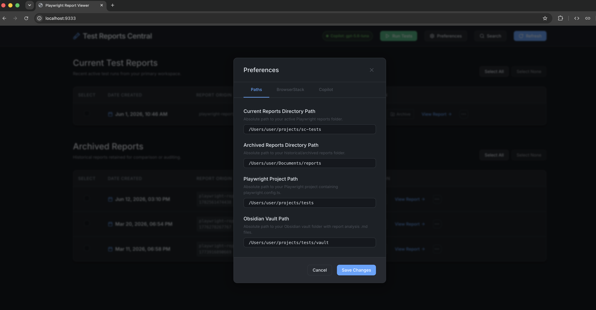

# Configuration

[Back to documentation](index.md) | [Previous: Getting Started](getting-started.md) | [Next: Running Tests](running-tests.md)

After the first launch, open **Preferences** in the top-right corner and configure the dashboard tabs.

 

## Paths

Use absolute paths for each directory.

| Setting | Purpose |
| --- | --- |
| Current Reports Directory | Folder where the Playwright project writes new HTML reports, such as `playwright-report` |
| Archived Reports Directory | Folder where historical reports should be stored |
| Playwright Project Path | Project directory containing `playwright.config.ts`; required by the test runner |
| Obsidian Vault Path | Optional directory containing Markdown analysis files |

## BrowserStack

Configure these fields when tests will run on BrowserStack:

- **BrowserStack Username**: Your BrowserStack username.
- **BrowserStack Access Key**: Your access key. The UI displays this as a password field.
- **BrowserStack Config**: Config filename relative to the Playwright project root, such as `browserstack.falcons.yml`.

## Copilot

The optional **GitHub Token** authenticates the Copilot SDK used for AI failure analysis. When it is empty, the dashboard falls back to the host's Copilot CLI or GitHub CLI login.

Click **Save Changes** after editing the settings. The dashboard immediately scans the configured directories and displays valid reports.

Configuration, presets, and report metadata are stored in the local SQLite database `app.db`.

## Select a Copilot model

The header's **Copilot** chip shows authentication status and the active model as `Copilot: <model>`.

- On dashboard load, the chip checks authentication and lists the models available to the account.
- With no saved selection, the first available model is selected automatically.
- Click the chip to check the status again and open the model picker.
- Selecting a model saves it immediately and uses it for subsequent AI failure analyses.
- If authentication fails or no models are available, clicking the chip opens an error dialog with the details.
- If a saved model becomes unavailable, the first available model is selected and a warning explains the change.

Continue with [Running Tests](running-tests.md), or go directly to [Managing Reports](reports.md) when reports already exist.
