# Failure Analysis

[Back to documentation](index.md) | [Previous: Managing Reports](reports.md) | [Next: Trace Digestion](trace-digestion.md)

Failure analysis turns the failed attempts in a current report into compact, agent-ready folders, extracts canonical issue evidence for each analyzable failure, and groups those records into run-level problems.

## Before you begin

Use the **Copilot** tab in [Preferences](configuration.md#copilot) to configure an optional GitHub token and select the small per-trace model and big grouping model. If no token is provided, the dashboard uses the host's Copilot CLI or GitHub CLI authentication. The header chip checks access only.

## Analyze a report

1. Open the overflow menu on a current report.
2. Click **Analyze Failures**.
3. Keep the dashboard open while the row progress bar is active. Large reports and antivirus scanning can make this operation take time.
4. When analysis finishes, use **Copy Relative Path**, **View index.json**, or **View grouped-analysis.md** in the completion dialog.

The dashboard runs the installed [`@andrii_kremlovskyi/playwright-traces-reader`](https://www.npmjs.com/package/@andrii_kremlovskyi/playwright-traces-reader) `failures` command and writes output below the Current Reports Directory:

```text
<currentPath>/tmp/run-<timestamp>/
```

## Concurrent requests and trace extraction

Only one failure-analysis request may run for a report at a time. Repeated clicks in the same dashboard page are ignored while that report is active. If another browser tab or client starts the same report concurrently, the server returns `FAILURE_ANALYSIS_IN_PROGRESS`; the row briefly shows **Analysis already running** instead of starting a second CLI process. Different reports can still be analyzed independently, and the bounded three-way Copilot processing inside one completed digest is unaffected.

The trace reader does not extract ZIPs into the report. It uses a persistent, content-addressed cache under the operating system's temporary directory:

```text
<os.tmpdir>/playwright-traces-reader/trace-cache/
```

Concurrent readers publish completed cache entries atomically. The reader accepts a verified competing entry and retries transient Windows `EPERM` rename failures, including brief antivirus or indexing locks. The source report remains unchanged. Before analysis starts, completed entries unused for 24 hours and staging entries older than 1 hour are pruned, unless another live reader lease exists. `PWTR_CACHE_MAX_AGE_HOURS` and `PWTR_CACHE_STAGING_MAX_AGE_HOURS` override those defaults; `0` disables the corresponding age policy. There is no size cap. When no analysis or trace-reader library consumer is running, the entire cache can be deleted and will be rebuilt on demand. See [Troubleshooting](troubleshooting.md#failure-analysis-fails-with-a-trace-cache-eperm-error) for recovery steps.

## Analysis directory layout

Every failed attempt, including each retry, receives a separate folder. A generated run has this general layout:

```text
run-<timestamp>/
|-- index.json
|-- grouped-analysis.md
|-- <sanitized-test-title>__retry0/
|   |-- evidence.json
|   |-- ai-analysis.md
|   |-- error.md
|   |-- failure.json
|   |-- screenshots/
|   |-- console-errors.json
|   `-- network-errors.json
`-- <sanitized-test-title>__retry1/
	|-- evidence.json
	|-- ai-analysis.md
	|-- error.md
	|-- failure.json
	`-- screenshots/
```

`index.json` is the run manifest. It lists the failed attempts and maps each entry to its output folder. Retry folders are independent records because different attempts of the same test can fail at different steps.

The console and network error files are created only when the trace contains that type of evidence. Before Hooks and skipped entries can appear in the manifest, but they are not treated as analyzable test failures and do not receive an AI analysis record.

## End-to-end data flow

```mermaid
flowchart TD
	USER["User clicks Analyze Failures"] --> API["POST /api/failures<br/>server.ts"]

	API --> CLI["Trace reader CLI<br/>node cli.js failures REPORT OUTPUT --format json"]
	CLI --> RUN["Generated run directory"]
	RUN --> MANIFEST["index.json<br/>attempt manifest"]
	RUN --> FOLDERS["One folder per attempt/retry"]
	FOLDERS --> RAW["Raw extracted evidence<br/>error.md<br/>failure.json<br/>network errors<br/>console errors<br/>screenshots"]

	MANIFEST --> FILTER{"Analyzable?<br/>Not skipped or Before Hooks"}
	FILTER -->|No| SKIP["Excluded from model analysis"]
	FILTER -->|Yes| POOL["analyzeRun<br/>3 attempts concurrently"]

	subgraph SMALL_FLOW["Per-attempt evidence flow"]
		POOL --> BLOCKS["errorDetailBlocks<br/>One fenced error block = one issue"]
		BLOCKS --> SMALL["Configured small model<br/>One attempt per session"]
		RAW --> SMALL_INPUT["Model input<br/>full error.md<br/>sanitized failure metadata<br/>optional network errors"]
		SMALL_INPUT --> SMALL

		SMALL --> EXPLANATION["Model returns one explanation per block<br/>summary and operation<br/>expected and observed<br/>supported likely cause<br/>relevant signals<br/>confidence and unknowns"]
		EXPLANATION --> VALIDATE{"Schema, count, and order valid?"}

		VALIDATE -->|No| CORRECT["One correction turn<br/>precise validation error"]
		CORRECT --> VALIDATE2{"Corrected response valid?"}
		VALIDATE2 -->|No| FALLBACK["Low-confidence fallback<br/>Exact source blocks are retained"]
		VALIDATE -->|Yes| ATTACH["Application attaches exact source blocks"]
		VALIDATE2 -->|Yes| ATTACH
		FALLBACK --> EVIDENCE
		ATTACH --> EVIDENCE["evidence.json<br/>Canonical schema v4"]
		EVIDENCE --> MARKDOWN["Deterministic renderer<br/>No model call"]
		MARKDOWN --> AI_MD["ai-analysis.md"]
	end

	EVIDENCE --> COUNT{"More than one<br/>analyzable attempt?"}
	COUNT -->|No| DONE_SINGLE["Per-attempt analysis complete"]
	COUNT -->|Yes| CATALOG["Build flat issue catalog<br/>I1, I2, I3..."]

	subgraph BIG_FLOW["Run-level grouping flow"]
		CATALOG --> BIG["Configured big model<br/>Tool-free grouping session"]
		BIG_INPUT["Big-model input<br/>test/spec/retry metadata<br/>exact primary error line<br/>small-model explanation"] --> BIG

		BIG --> PROVISIONAL["Complete provisional grouping<br/>summary + problems<br/>every issue ID exactly once<br/>optional evidenceRequests"]
		PROVISIONAL --> REQUEST{"Source evidence requested?"}

		REQUEST -->|Yes| BOUNDED["Application loads selected current-run snippets<br/>error block / final page<br/>test source / network"]
		BOUNDED --> LIMITS["Enforced limits<br/>10 requests maximum<br/>4 issues per request<br/>30 issue references<br/>6,000 chars per section<br/>48,000 chars total<br/>4 MiB per source file"]
		LIMITS --> BIG2["One final evidence turn<br/>No second retrieval round"]
		BIG2 --> FINAL_GROUPS["Final grouping response"]
		REQUEST -->|No| FINAL_GROUPS

		FINAL_GROUPS --> CONTRACT{"Reference contract valid?<br/>all IDs exactly once"}
		CONTRACT -->|No| REPAIR["One repair turn<br/>missing / unknown / duplicate IDs"]
		REPAIR --> RECHECK{"Repair valid?"}
		RECHECK -->|No| SANITIZE["Structural sanitization<br/>remove invalid references<br/>retain unassigned as Unclassified"]
		RECHECK -->|Yes| RENDER
		CONTRACT -->|Yes| RENDER["Application renders report"]
		SANITIZE --> RENDER

		RENDER --> RECONCILE["Reconcile grouped issue count<br/>against extracted issues"]
		RECONCILE --> GROUPED["grouped-analysis.md"]
	end
```



The ownership boundary is intentional: application code owns source preservation, schema checks, path containment, evidence budgets, and rendering. The small model explains each source block, and the big model owns semantic grouping.

| Stage                   | Model receives                                                                                              | Application retains control of                                                                    |
| ----------------------- | ----------------------------------------------------------------------------------------------------------- | ------------------------------------------------------------------------------------------------- |
| Small model             | Full `error.md`, sanitized step metadata, and optional network errors.                                      | Exact source blocks, issue count and order, validation, fallback, and artifact rendering.         |
| Big model               | Manifest context plus each issue's exact primary error line and compact small-model explanation.            | ID/reference validation, evidence limits, path containment, report rendering, and reconciliation. |
| Big-model evidence turn | Only specifically requested, bounded current-run error-block, final-page, test-source, or network sections. | Arbitrary file access or additional retrieval rounds.                                             |

## What `evidence.json` and `ai-analysis.md` contain

After trace extraction, application code parses every fenced block under `# Error details` and writes schema-v4 `evidence.json` beside `error.md`. Each issue contains:

- `blockIndex`, preserving the 1-based source order.
- `source.error`, the first error line, and `source.block`, the exact fenced source block. Both are attached by the application rather than copied from model output.
- `analysis.summary`, nullable `operation`, `expected`, `observed`, and `likelyCause`, arrays of `relevantSignals` and `unknowns`, and `confidence` (`high`, `medium`, or `low`).

The schema intentionally has no application-derived failure family, state key, lifecycle, issue relationship, causal anchor, resolution, or incident key. Supporting metadata can help the small model explain a block, but it cannot create or remove issues.

The dashboard renders `ai-analysis.md` deterministically from the same JSON; there is no Markdown-generation model call. The report shows attempt metadata and every issue's explanation beside its exact source block.

If the first response is not valid JSON, has the wrong issue count or order, or violates the field types, the dashboard makes one focused correction request in the same small-model session. The correction includes the exact validation error and the required schema shape.

`error.md` remains ground truth. `evidence.json` is the canonical model-to-model contract, while `ai-analysis.md` is its human-readable view. `failure.json`, screenshots, and conditional console or network files provide deeper raw evidence when needed.

If the corrected response is still invalid, the dashboard creates one low-confidence fallback issue per source block and keeps each exact block with a warning. A folder is unavailable only when its source files cannot be read or processed. One failed record does not stop analysis of the other failure folders.

## Grouped problem analysis

After every per-attempt record finishes, the dashboard makes an initial Copilot grouping request using the configured big model. The request embeds only:

- The manifest metadata needed for retries, outcomes, and test identity.
- Each issue's exact primary error line and compact small-model explanation from `evidence.json`.

The initial request never sends raw `error.md`, `failure.json`, screenshots, console/network files, previous analyses, vault files, knowledge-base files, or ADO/defect information. The grouping session has no tools enabled.

The grouping projection omits the full source block. Long explanatory fields are bounded to 1,200 characters. Full records remain unchanged in `evidence.json`, and selected source sections remain available through the bounded evidence turn. High-reasoning grouping, evidence, and repair requests each have a 10-minute timeout; diagnostics report the actual prompt size, elapsed time, and configured timeout.

The big model decides which issues represent the same underlying problem by considering their errors, expected and observed behavior, operations, concrete signals, and directly supported causes together. Application code does not force semantic merges or splits. Test titles, retries, manifest steps, broad categories, and generic wording are context rather than proof of identity. Every issue receives a compact ID such as `I1` or `I2` and must be assigned exactly once.

When a plausible merge cannot be decided because critical evidence is missing, ambiguous, or conflicting, a complete provisional response may request one bounded source-evidence round. The application first verifies that the provisional response references every issue exactly once, then accepts only current-run issue IDs and the `error-block`, `final-page`, `test-source`, or `network` sections. It allows at most 10 requests, 4 issue IDs per request, 30 issue references overall, 6,000 characters per section, 48,000 characters of extracted source text overall, and 4 MiB per source file read. Every resolved file must remain inside its assigned failure folder. The selected snippets are sent in a second turn in the same session; no arbitrary file access or second evidence round is allowed. If retrieval or the final response fails, the complete provisional grouping is retained and validated.

After the final response, the dashboard maps issue IDs back to folders and block positions before writing `grouped-analysis.md`, then derives retries, outcomes, test metadata, failure folders, and reconciliation counts from the manifest.

If the response has missing, unknown, or duplicate IDs, the dashboard sends one focused reference-repair turn in the same session. It supplies the previous complete response, the exact allowed ID set, structural diagnostics, and compact evidence for affected valid issues. The corrected response must assign every allowed ID exactly once without changing valid assignments unnecessarily. A failed repair does not discard the initial result: the dashboard removes unknown and duplicate references, drops problems left empty, and retains unassigned valid issues under `Unclassified - invalid grouping references`. This fallback repairs structure only; it does not reinterpret or regroup valid model assignments.

`grouped-analysis.md` contains a summary table, one full section per problem, exact failure-folder pointers, and an extracted-issue reconciliation check. It intentionally contains no previous-run comparison, ADO defects, defect states, products, knowledge-base enrichment, tracked issues, or action-item history. Those remain follow-up work outside the dashboard.

When source-backed evidence cannot be created for a folder, its attempt is retained in an Unclassified problem without reading raw evidence during grouping. If the final grouping request or its validation fails, the digest and all completed evidence files remain available; the completion dialog reports a grouping warning and does not link an invalid grouped report.

Depending on the available trace data, each failure folder can contain:

- `failure.json`
- Failure screenshots
- Network and console errors
- `error.md`
- `evidence.json`
- `ai-analysis.md`

## Manage analysis runs

Every successful failure-analysis run is stored against the report's stable identity and appears under **Analysis runs** in the report's **Info** dialog. Each run can have two independently managed artifacts:

- **Output directory:** The ephemeral `<currentPath>/tmp/run-<timestamp>/` directory containing `index.json`, `grouped-analysis.md`, per-attempt folders, `evidence.json`, `ai-analysis.md`, and the raw evidence. From the Info dialog, you can copy its path, open `index.json` or the grouped analysis, or delete the entire output directory.
- **Analysis file:** An optional, longer-lived `<runName>.md` note mapped from the configured vault. You can copy its path, open the rendered Markdown page, or delete the file independently of the output directory.

The artifacts follow this lifecycle:

- **Report rename:** The analysis runs remain attached because they are keyed by the report's stable internal identity rather than its folder name.
- **Delete output directory:** The generated `tmp/run-*` directory and all files inside it, including `grouped-analysis.md`, are removed. The run entry and any mapped vault analysis file remain available in the Info dialog.
- **Delete analysis file:** The vault Markdown file is removed. The generated output directory remains available when it still exists. If both artifacts are gone, the empty run entry is removed as well.
- **Archive report:** The ephemeral output directory and its grouped analysis are removed because they do not follow the report into the archive. An existing vault analysis file is moved to `<archivePath>/analysis/`, and its mapping remains attached to the archived report.
- **Delete report:** The output directories, mapped analysis files, and database run records associated with that report are removed.
- **Report removed or replaced outside the dashboard:** The next directory scan removes run records belonging to the missing report instance and prevents them from being attached to a new report that reuses the same folder name.

Deleting an output directory does not change the Playwright report folder itself; analysis output lives under the Current Reports Directory's separate `tmp` folder.

For one test rather than every failure in a report, use [Selective Trace Digestion](trace-digestion.md).
