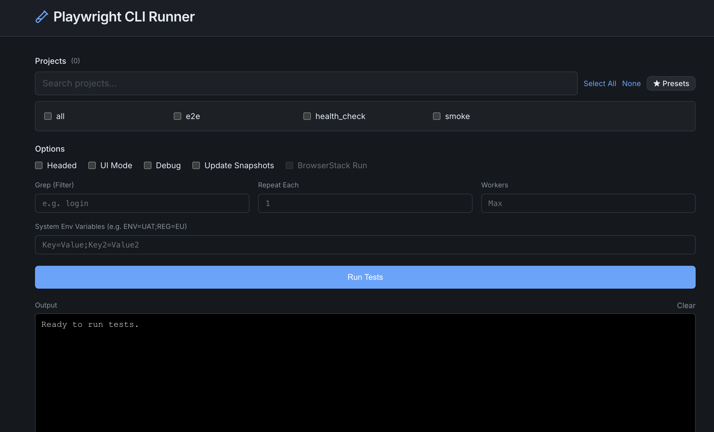

# Running Tests

[Back to documentation](index.md) | [Previous: Configuration](configuration.md) | [Next: Managing Reports](reports.md)

Click **Run Tests** on the dashboard to open the integrated runner.

## Choose configurations

The runner recursively discovers configuration files below the configured Playwright Project Path:

- `**/*playwright*.config.{ts,js,mts,mjs,cts,cjs}`
- `**/*browserstack*.{yml,yaml}`

Select a Playwright config first. Its relative path is persisted and its projects are loaded immediately. BrowserStack configs use the same relative-path persistence; their dropdown remains visible but disabled until **BrowserStack Run** is enabled. Files below `node_modules` and `test-results` are ignored.

## Choose what to run

The runner parses the selected Playwright config and lists its projects. Select the required projects, then configure the available execution options:

- Headed mode
- Headless mode
- UI mode
- Debug mode
- Grep filters
- Worker count
- Repeat count
- Environment variables

Runner options are persisted across dashboard restarts.

**Headed** and **Headless** are mutually exclusive overrides. Select neither to use the `use.headless` value from `playwright.config.ts`; select either mode to override that value for the run. Debug mode opens a headed browser, so selecting Debug clears Headless.

## Save project presets

Save the current project selection as a named preset to reuse a common test group. When a preset references projects that do not exist in the selected Playwright config, the runner identifies the missing projects before execution.

## Run on BrowserStack

Select a discovered BrowserStack config, then enable **BrowserStack Run** to dispatch through `browserstack-node-sdk` using credentials from [Configuration](configuration.md).

BrowserStack mode automatically disables incompatible local options such as Headed, Headless, UI Mode, and Debug, and locks the Workers and Repeat inputs.

## Follow or stop the run

The embedded `xterm.js` terminal streams colored process output while tests run. You can stop an active run from the runner; the dashboard terminates the associated process tree to avoid leaving background Node.js processes.

Completed HTML reports appear in the configured current reports directory and can then be handled from [Managing Reports](reports.md).
